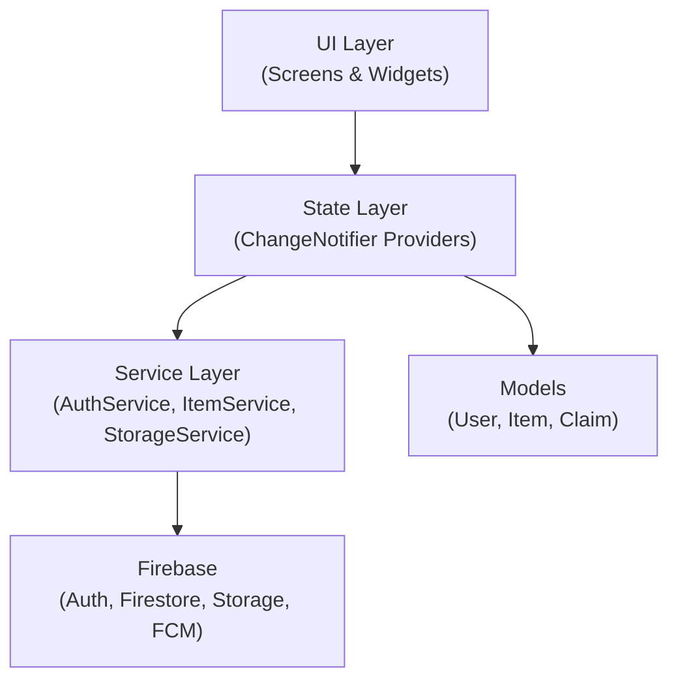

# FULafia Lost & Found Management System — Implementation Plan

## Project Overview

A mobile-based Lost and Found management system for the Federal University of Lafia (FULafia) community. The app allows students and staff to report lost/found items with images, descriptions, and campus locations, then search and match items through keywords, categories, and date ranges.

**Target**: Android (primary), iOS (bonus)  
**Framework**: Flutter 3.38.7 / Dart 3.10.7  
**Backend**: Firebase (see open questions)

---

## User Review Required

> [!IMPORTANT]
> **Backend Choice**: This plan uses **Firebase** (Authentication + Cloud Firestore + Firebase Storage + Cloud Messaging). Firebase has a generous free tier, handles auth/storage/realtime out of the box, and is ideal for a final year project timeline. If you have a preference for a different backend (e.g., Supabase, custom Node.js API), let me know before we begin.

> [!IMPORTANT]
> **Admin Panel**: Do you need a simple admin dashboard (web or in-app) for university security/student affairs staff to moderate posts, verify claims, and manage users? This would strengthen your project significantly for evaluation.

---

## Open Questions

1. **University Email Domain** — Is the student email format `@fulafia.edu.ng`? We'll use this to validate university-only registration.
2. **Matriculation Number Format** — What's the typical format (e.g., `FUL/CS/20/001`)? We'll validate this during registration.
3. **Notifications** — Do you want push notifications when a potential match is found, or just in-app notifications?
4. **Admin Role** — Should there be an admin role (e.g., security office or student affairs) that can moderate and delete inappropriate posts?
5. **Claim/Handover Flow** — When someone finds a match, should they: (a) Chat with the reporter in-app, (b) Simply see contact details, or (c) Submit a claim request that the reporter approves/rejects?
6. **Dark Mode** — Do you want dark mode support, or just light theme?

---

## Tech Stack

| Layer | Technology | Justification |
|:------|:-----------|:-------------|
| **Framework** | Flutter 3.38.7 | Cross-platform, single codebase, strong UI toolkit |
| **Language** | Dart 3.10.7 | Already configured in workspace |
| **State Management** | Provider | Simpler learning curve, well-documented, sufficient for this scope |
| **Backend** | Firebase | Free tier, real-time sync, managed infrastructure |
| **Auth** | Firebase Authentication | Email/password with domain validation |
| **Database** | Cloud Firestore | NoSQL, real-time listeners, offline support |
| **Storage** | Firebase Storage | Image upload/retrieval for item photos |
| **Notifications** | Firebase Cloud Messaging (FCM) | Push notifications for matches |
| **Image Picker** | `image_picker` package | Camera + gallery access |
| **Routing** | `go_router` | Declarative, type-safe navigation |
| **Forms** | Built-in Flutter forms | Validation, controllers |

### Key Dependencies (pubspec.yaml)

```yaml
dependencies:
  flutter:
    sdk: flutter
  firebase_core: ^3.x
  firebase_auth: ^5.x
  cloud_firestore: ^5.x
  firebase_storage: ^12.x
  firebase_messaging: ^15.x
  provider: ^6.x
  go_router: ^14.x
  image_picker: ^1.x
  cached_network_image: ^3.x
  intl: ^0.19.x
  uuid: ^4.x
  flutter_local_notifications: ^18.x
  shimmer: ^3.x          # Loading placeholders
  timeago: ^3.x          # "2 hours ago" formatting
  cupertino_icons: ^1.0.8
```

---

## Architecture



### Folder Structure

```
lib/
├── main.dart                    # App entry point
├── app.dart                     # MaterialApp + routing config
├── config/
│   ├── theme.dart               # App theme (colors, typography)
│   ├── constants.dart           # Campus locations, categories, etc.
│   └── routes.dart              # GoRouter route definitions
├── models/
│   ├── user_model.dart          # User data model
│   ├── item_model.dart          # Lost/Found item model
│   └── claim_model.dart         # Claim request model
├── services/
│   ├── auth_service.dart        # Firebase Auth wrapper
│   ├── item_service.dart        # Firestore CRUD for items
│   ├── storage_service.dart     # Firebase Storage for images
│   ├── notification_service.dart# FCM + local notifications
│   └── matching_service.dart    # Search & match algorithm
├── providers/
│   ├── auth_provider.dart       # Auth state management
│   ├── item_provider.dart       # Items state management
│   └── theme_provider.dart      # Theme management
├── screens/
│   ├── splash/
│   │   └── splash_screen.dart
│   ├── onboarding/
│   │   └── onboarding_screen.dart
│   ├── auth/
│   │   ├── login_screen.dart
│   │   └── register_screen.dart
│   ├── home/
│   │   └── home_screen.dart      # Tab-based: Lost | Found | My Posts
│   ├── report/
│   │   └── report_item_screen.dart  # Report lost or found item
│   ├── detail/
│   │   └── item_detail_screen.dart
│   ├── search/
│   │   └── search_screen.dart
│   ├── profile/
│   │   └── profile_screen.dart
│   ├── claims/
│   │   └── claims_screen.dart
│   └── notifications/
│       └── notifications_screen.dart
├── widgets/
│   ├── item_card.dart           # Reusable item card widget
│   ├── category_chip.dart       # Category filter chips
│   ├── location_dropdown.dart   # Campus location selector
│   ├── image_picker_widget.dart # Image capture/selection
│   ├── empty_state.dart         # Empty list placeholder
│   ├── loading_shimmer.dart     # Skeleton loading
│   └── custom_button.dart       # Styled buttons
└── utils/
    ├── validators.dart          # Form validation helpers
    ├── date_formatter.dart      # Date formatting utilities
    └── image_compressor.dart    # Compress images before upload
```

---

## Data Models

### User Model

```dart
class UserModel {
  final String uid;
  final String fullName;
  final String email;
  final String matricNumber;     // e.g., "FUL/CS/20/001"
  final String department;
  final String faculty;
  final String phoneNumber;
  final String? profileImageUrl;
  final String role;             // "student", "staff", "admin"
  final DateTime createdAt;
}
```

### Item Model

```dart
class ItemModel {
  final String id;
  final String title;
  final String description;
  final ItemType type;           // ItemType.lost or ItemType.found
  final String category;         // "Electronics", "ID Cards", etc.
  final String campusLocation;   // "Faculty of Computing", "Library", etc.
  final String? specificLocation;// "Room 204, Block B"
  final List<String> imageUrls;
  final DateTime dateOccurred;   // When item was lost/found
  final DateTime dateReported;   // When reported on app
  final String reporterUid;
  final String reporterName;
  final ItemStatus status;       // active, claimed, resolved, expired
  final String? claimedByUid;
  final List<String> searchKeywords; // For search optimization
}

enum ItemType { lost, found }
enum ItemStatus { active, claimed, resolved, expired }
```

### Claim Model

```dart
class ClaimModel {
  final String id;
  final String itemId;
  final String claimantUid;
  final String claimantName;
  final String message;          // "I can describe the case color..."
  final ClaimStatus status;      // pending, approved, rejected
  final DateTime createdAt;
}

enum ClaimStatus { pending, approved, rejected }
```

---

## FULafia-Specific Constants

### Campus Locations

| # | Location |
|:--|:---------|
| 1 | Faculty of Agriculture |
| 2 | Faculty of Arts |
| 3 | Faculty of Computing |
| 4 | Faculty of Education |
| 5 | Faculty of Engineering |
| 6 | Faculty of Environmental Design |
| 7 | Faculty of Law |
| 8 | Faculty of Life Sciences |
| 9 | Faculty of Management Science |
| 10 | Faculty of Physical Sciences |
| 11 | Faculty of Social Science |
| 12 | College of Health Sciences |
| 13 | College of Medicine |
| 14 | University Library |
| 15 | ICT Centre |
| 16 | Senate Building |
| 17 | Student Hostels |
| 18 | University Cafeteria |
| 19 | Sports Complex |
| 20 | Lecture Theatres |
| 21 | Student Union Building |
| 22 | Main Gate Area |
| 23 | Car Park |
| 24 | Other |

### Item Categories

| # | Category | Icon |
|:--|:---------|:-----|
| 1 | Electronics (Phones, Laptops, Chargers) | `Icons.devices` |
| 2 | ID Cards & Documents | `Icons.badge` |
| 3 | Keys | `Icons.key` |
| 4 | Books & Stationery | `Icons.menu_book` |
| 5 | Bags & Backpacks | `Icons.backpack` |
| 6 | Clothing & Accessories | `Icons.checkroom` |
| 7 | Wallets & Purses | `Icons.account_balance_wallet` |
| 8 | Jewellery & Watches | `Icons.watch` |
| 9 | Water Bottles & Containers | `Icons.local_drink` |
| 10 | Eyeglasses | `Icons.visibility` |
| 11 | Umbrellas | `Icons.umbrella` |
| 12 | Other | `Icons.category` |

---

## Screen-by-Screen Breakdown

### 1. Splash Screen
- FULafia logo + app name animation
- Check auth state → route to onboarding/login/home

### 2. Onboarding Screen (3 slides)
- Slide 1: "Report Lost Items" — illustration + description
- Slide 2: "Upload Found Items" — illustration + description
- Slide 3: "Find Matches" — illustration + description
- "Get Started" button

### 3. Registration Screen
- Full Name
- University Email (`@fulafia.edu.ng` validation)
- Matriculation Number (format validation)
- Department (dropdown by faculty)
- Phone Number
- Password (min 8 chars, strength indicator)
- "Register" → email verification sent

### 4. Login Screen
- Email or Matric Number
- Password
- "Forgot Password" link
- "Don't have an account? Register" link

### 5. Home Screen (Bottom Navigation)
- **Tab 1 — Lost Items Feed**: Scrollable list of lost items, sorted by most recent
- **Tab 2 — Found Items Feed**: Scrollable list of found items
- **Tab 3 — My Posts**: User's own lost/found reports
- **Tab 4 — Profile**: User settings and info
- **FAB**: Quick "Report Item" button

### 6. Report Item Screen
- Toggle: "I lost something" / "I found something"
- Title (text field)
- Description (multiline text)
- Category (dropdown from predefined list)
- Campus Location (dropdown)
- Specific Location (optional text — "Near the water tank behind Block C")
- Date Lost/Found (date picker)
- Images (up to 3, from camera or gallery)
- "Submit Report" button

### 7. Item Detail Screen
- Image carousel (swipeable)
- Title, description, category, location
- Date reported + date occurred
- Reporter info (name, department)
- Status badge (Active / Claimed / Resolved)
- "Claim This Item" button (if viewer is not the reporter)
- "Mark as Resolved" button (if viewer is the reporter)

### 8. Search & Filter Screen
- Search bar (keyword search across title + description)
- Filter chips: Category, Location, Date Range, Type (Lost/Found)
- Results list with highlighting
- "No results" empty state with suggestions

### 9. Claims Screen
- **Incoming Claims** tab: Claims on your reported items → approve/reject
- **My Claims** tab: Claims you've submitted → view status

### 10. Notifications Screen
- New match found
- Claim received on your item
- Claim status updated
- System announcements

### 11. Profile Screen
- Profile photo
- User details (name, matric, department, email)
- Edit profile
- My statistics (items reported, items resolved)
- Logout
- About / Help

---

## Search & Matching Algorithm

The matching mechanism will work at two levels:

### 1. Manual Search
Users can search with:
- **Keywords**: Full-text search across `title`, `description`, and `searchKeywords` fields
- **Category filter**: Exact match on category
- **Location filter**: Exact match on campus location
- **Date range**: Filter items within a date window
- **Type filter**: Lost only, Found only, or both

### 2. Automated Matching (Smart Suggestions)
When a user reports a **lost** item, the system queries **found** items (and vice versa) using:
- Same category
- Same or nearby campus location
- Date overlap (found date ≥ lost date)
- Keyword overlap between descriptions

Matches are displayed as "Potential Matches" on the item detail screen.

---

## Firestore Database Structure

```
users/
  {uid}/
    fullName, email, matricNumber, department, faculty,
    phoneNumber, profileImageUrl, role, createdAt

items/
  {itemId}/
    title, description, type, category, campusLocation,
    specificLocation, imageUrls[], dateOccurred, dateReported,
    reporterUid, reporterName, status, claimedByUid,
    searchKeywords[]

claims/
  {claimId}/
    itemId, claimantUid, claimantName, message, status, createdAt

notifications/
  {uid}/
    notifications/
      {notifId}/
        title, body, type, itemId, isRead, createdAt
```

### Firestore Indexes Required
- `items`: composite index on `(type, status, dateReported DESC)`
- `items`: composite index on `(type, category, status)`
- `items`: composite index on `(type, campusLocation, status)`
- `claims`: composite index on `(itemId, status)`

---

## Design System

### Color Palette
The FULafia brand colors will guide the palette:

| Token | Value | Usage |
|:------|:------|:------|
| Primary | `#1B5E20` (Deep Green) | App bar, buttons, primary actions |
| Primary Light | `#4CAF50` (Green) | Highlights, accents |
| Secondary | `#E65100` (Deep Orange) | "Lost" items badge, urgency |
| Tertiary | `#0D47A1` (Deep Blue) | "Found" items badge |
| Surface | `#FAFAFA` | Card backgrounds |
| Background | `#F5F5F5` | Screen background |
| On Primary | `#FFFFFF` | Text on primary color |
| Error | `#D32F2F` | Error states |
| Success | `#388E3C` | Resolved items, success |

### Typography
- **Headlines**: Google Fonts — `Outfit` (bold, modern)
- **Body**: Google Fonts — `Inter` (clean, readable)

### Component Styling
- Cards with `borderRadius: 16`, subtle elevation
- Rounded buttons with `borderRadius: 12`
- Status badges with color-coded chips
- Smooth page transitions and hero animations for images

---

## Proposed Changes

### Phase 1 — Project Setup & Configuration

#### [MODIFY] [pubspec.yaml](file:///c:/Users/onahe/OneDrive/Desktop/StudentProjects/lost_and_found/pubspec.yaml)
- Add all required dependencies (Firebase, Provider, go_router, image_picker, etc.)
- Configure assets directory for images and fonts

#### [NEW] `android/` Firebase configuration
- Add `google-services.json` (you'll need to create a Firebase project)
- Update `android/build.gradle` and `android/app/build.gradle` for Firebase

---

### Phase 2 — Core Architecture (Config, Models, Services)

#### [NEW] `lib/config/theme.dart`
- Complete Material 3 theme with FULafia colors, typography, component themes

#### [NEW] `lib/config/constants.dart`
- Campus locations list, item categories with icons, matric number regex

#### [NEW] `lib/config/routes.dart`
- GoRouter configuration with all routes and auth redirect logic

#### [MODIFY] `lib/main.dart`
- Firebase initialization, Provider setup, routing

#### [NEW] `lib/app.dart`
- MaterialApp.router with theme and router config

#### [NEW] `lib/models/user_model.dart`
- User data class with `fromMap()`, `toMap()`, `copyWith()`

#### [NEW] `lib/models/item_model.dart`
- Item data class with enums, serialization, keyword generation

#### [NEW] `lib/models/claim_model.dart`
- Claim data class with status enum

---

### Phase 3 — Services Layer

#### [NEW] `lib/services/auth_service.dart`
- Register with email validation (`@fulafia.edu.ng`)
- Login, logout, password reset
- Create user profile in Firestore on registration

#### [NEW] `lib/services/item_service.dart`
- Create, read, update, delete items
- Query with filters (category, location, date, type)
- Real-time stream listeners
- Pagination with `limit()` and `startAfter()`

#### [NEW] `lib/services/storage_service.dart`
- Upload images to Firebase Storage
- Compress before upload
- Generate download URLs
- Delete images when item is resolved

#### [NEW] `lib/services/matching_service.dart`
- Find potential matches for a given item
- Score matches by relevance (category + location + date + keywords)

#### [NEW] `lib/services/notification_service.dart`
- FCM setup and token management
- Local notification display
- Notification read/unread management

---

### Phase 4 — State Management (Providers)

#### [NEW] `lib/providers/auth_provider.dart`
- Current user state, auth state changes, loading/error states

#### [NEW] `lib/providers/item_provider.dart`
- Item lists (lost/found/mine), filters, search query, pagination

#### [NEW] `lib/providers/theme_provider.dart`
- Light/dark mode toggle (if approved)

---

### Phase 5 — UI Screens

#### [NEW] `lib/screens/splash/splash_screen.dart`
#### [NEW] `lib/screens/onboarding/onboarding_screen.dart`
#### [NEW] `lib/screens/auth/login_screen.dart`
#### [NEW] `lib/screens/auth/register_screen.dart`
#### [NEW] `lib/screens/home/home_screen.dart`
#### [NEW] `lib/screens/report/report_item_screen.dart`
#### [NEW] `lib/screens/detail/item_detail_screen.dart`
#### [NEW] `lib/screens/search/search_screen.dart`
#### [NEW] `lib/screens/profile/profile_screen.dart`
#### [NEW] `lib/screens/claims/claims_screen.dart`
#### [NEW] `lib/screens/notifications/notifications_screen.dart`

---

### Phase 6 — Reusable Widgets

#### [NEW] `lib/widgets/item_card.dart`
#### [NEW] `lib/widgets/category_chip.dart`
#### [NEW] `lib/widgets/location_dropdown.dart`
#### [NEW] `lib/widgets/image_picker_widget.dart`
#### [NEW] `lib/widgets/empty_state.dart`
#### [NEW] `lib/widgets/loading_shimmer.dart`
#### [NEW] `lib/widgets/custom_button.dart`

---

### Phase 7 — Utilities & Polish

#### [NEW] `lib/utils/validators.dart`
- Email domain validation, matric format, phone number, password strength

#### [NEW] `lib/utils/date_formatter.dart`
- Relative time ("2 hours ago"), date range formatting

#### [NEW] `lib/utils/image_compressor.dart`
- Resize and compress images before Firebase upload

---

## Verification Plan

### Automated Tests
- Unit tests for models (`fromMap`, `toMap`, keyword generation)
- Unit tests for validators (email, matric number, etc.)
- Widget tests for key screens (login form validation, item card rendering)
- Run `flutter analyze` for lint compliance
- Run `flutter test` for all test suites

### Manual Verification
- Test on Android emulator and physical device
- Test complete user flow: Register → Login → Report Lost → Report Found → Search → Match → Claim → Resolve
- Test image upload from camera and gallery
- Test offline behavior (Firestore offline persistence)
- Test push notifications
- Verify university email validation blocks non-FULafia emails

### Performance Metrics (for Objective v)
- **Usability**: System Usability Scale (SUS) questionnaire with pilot testers
- **Response Time**: Measure Firestore read/write latency
- **User Satisfaction**: Likert-scale survey with 20-30 FULafia students/staff

---

## Build Order (Recommended)

| Phase | What | Est. Files |
|:------|:-----|:-----------|
| 1 | Project setup, Firebase config, dependencies | 3-4 files |
| 2 | Models, theme, constants, routes, app entry | 7-8 files |
| 3 | Services (auth, items, storage, matching) | 5 files |
| 4 | Providers (state management) | 3 files |
| 5 | Screens (all 11 screens) | 11 files |
| 6 | Reusable widgets | 7 files |
| 7 | Utilities, polish, testing | 4-5 files |

**Total: ~45-50 files** covering a complete, production-grade app.
