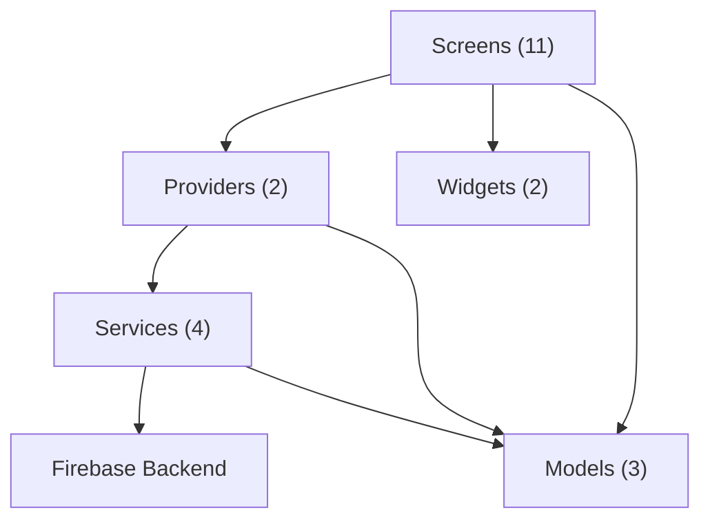

# FULafia Lost & Found — Build Walkthrough

## Summary

Built a complete **Mobile-Based Lost and Found Management System** for the Federal University of Lafia using **Flutter + Firebase**. The app has **27 Dart files** across a clean layered architecture.

## Architecture

## Files Created

### Config Layer
| File | Purpose |
|:-----|:--------|
| [theme.dart](file:///c:/Users/onahe/OneDrive/Desktop/StudentProjects/lost_and_found/lib/config/theme.dart) | FULafia green brand palette, Material 3, Outfit/Inter typography |
| [constants.dart](file:///c:/Users/onahe/OneDrive/Desktop/StudentProjects/lost_and_found/lib/config/constants.dart) | 24 campus locations, 12 item categories, matric regex, email domain |
| [routes.dart](file:///c:/Users/onahe/OneDrive/Desktop/StudentProjects/lost_and_found/lib/config/routes.dart) | GoRouter with auth guards and admin route protection |

---

### Models
| File | Purpose |
|:-----|:--------|
| [user_model.dart](file:///c:/Users/onahe/OneDrive/Desktop/StudentProjects/lost_and_found/lib/models/user_model.dart) | User with matric number, faculty, department, admin/staff roles |
| [item_model.dart](file:///c:/Users/onahe/OneDrive/Desktop/StudentProjects/lost_and_found/lib/models/item_model.dart) | Lost/Found items with categories, locations, images, search keywords |
| [claim_model.dart](file:///c:/Users/onahe/OneDrive/Desktop/StudentProjects/lost_and_found/lib/models/claim_model.dart) | Claim requests with pending/approved/rejected flow |

---

### Services
| File | Purpose |
|:-----|:--------|
| [auth_service.dart](file:///c:/Users/onahe/OneDrive/Desktop/StudentProjects/lost_and_found/lib/services/auth_service.dart) | Firebase Auth + Firestore user profiles, role management |
| [item_service.dart](file:///c:/Users/onahe/OneDrive/Desktop/StudentProjects/lost_and_found/lib/services/item_service.dart) | CRUD, real-time streams, search with filters, stats |
| [storage_service.dart](file:///c:/Users/onahe/OneDrive/Desktop/StudentProjects/lost_and_found/lib/services/storage_service.dart) | Firebase Storage image upload/delete |
| [claim_service.dart](file:///c:/Users/onahe/OneDrive/Desktop/StudentProjects/lost_and_found/lib/services/claim_service.dart) | Submit/approve/reject claims with batch operations |

---

### Providers
| File | Purpose |
|:-----|:--------|
| [auth_provider.dart](file:///c:/Users/onahe/OneDrive/Desktop/StudentProjects/lost_and_found/lib/providers/auth_provider.dart) | Auth state, login/register/logout, profile updates |
| [item_provider.dart](file:///c:/Users/onahe/OneDrive/Desktop/StudentProjects/lost_and_found/lib/providers/item_provider.dart) | Item/claim state, report, search, status updates |

---

### Screens (11 total)
| Screen | File | Features |
|:-------|:-----|:---------|
| **Splash** | [splash_screen.dart](file:///c:/Users/onahe/OneDrive/Desktop/StudentProjects/lost_and_found/lib/screens/splash/splash_screen.dart) | Animated logo, gradient, auto-navigate |
| **Onboarding** | [onboarding_screen.dart](file:///c:/Users/onahe/OneDrive/Desktop/StudentProjects/lost_and_found/lib/screens/onboarding/onboarding_screen.dart) | 3 slides, page indicators, skip button |
| **Login** | [login_screen.dart](file:///c:/Users/onahe/OneDrive/Desktop/StudentProjects/lost_and_found/lib/screens/auth/login_screen.dart) | Email/password, forgot password dialog |
| **Register** | [register_screen.dart](file:///c:/Users/onahe/OneDrive/Desktop/StudentProjects/lost_and_found/lib/screens/auth/register_screen.dart) | All fields + faculty/department cascading dropdowns |
| **Home** | [home_screen.dart](file:///c:/Users/onahe/OneDrive/Desktop/StudentProjects/lost_and_found/lib/screens/home/home_screen.dart) | 3 tabs (Lost/Found/My Posts), drawer, FAB |
| **Report** | [report_item_screen.dart](file:///c:/Users/onahe/OneDrive/Desktop/StudentProjects/lost_and_found/lib/screens/report/report_item_screen.dart) | Lost/found toggle, form, image picker (camera+gallery) |
| **Detail** | [item_detail_screen.dart](file:///c:/Users/onahe/OneDrive/Desktop/StudentProjects/lost_and_found/lib/screens/detail/item_detail_screen.dart) | Image carousel, claim submission, approve/reject |
| **Search** | [search_screen.dart](file:///c:/Users/onahe/OneDrive/Desktop/StudentProjects/lost_and_found/lib/screens/search/search_screen.dart) | Keyword + filters (type, category, location, dates) |
| **Profile** | [profile_screen.dart](file:///c:/Users/onahe/OneDrive/Desktop/StudentProjects/lost_and_found/lib/screens/profile/profile_screen.dart) | Avatar, stats, account info, logout |
| **Claims** | [claims_screen.dart](file:///c:/Users/onahe/OneDrive/Desktop/StudentProjects/lost_and_found/lib/screens/claims/claims_screen.dart) | Incoming/My Claims tabs with approve/reject |
| **Admin** | [admin_screen.dart](file:///c:/Users/onahe/OneDrive/Desktop/StudentProjects/lost_and_found/lib/screens/admin/admin_screen.dart) | Dashboard stats, all items (swipe delete), user roles |

---

### Widgets & Utils
| File | Purpose |
|:-----|:--------|
| [item_card.dart](file:///c:/Users/onahe/OneDrive/Desktop/StudentProjects/lost_and_found/lib/widgets/item_card.dart) | Thumbnail, type badge, location, timestamp |
| [common_widgets.dart](file:///c:/Users/onahe/OneDrive/Desktop/StudentProjects/lost_and_found/lib/widgets/common_widgets.dart) | EmptyState, PrimaryButton, ItemCardShimmer, StatusBadge |
| [validators.dart](file:///c:/Users/onahe/OneDrive/Desktop/StudentProjects/lost_and_found/lib/utils/validators.dart) | Email, matric, phone, password, item fields |

---

## Verification

- `flutter pub get` — all dependencies resolved successfully
- `flutter analyze` — **0 errors, 0 warnings** (8 info-level style hints only)

---

## Next Steps: Firebase Setup

Before the app can run, you need to connect it to Firebase:

1. **Go to** [Firebase Console](https://console.firebase.google.com) and create a new project (name: `fulafia-lost-and-found`)
2. **Install FlutterFire CLI**: `dart pub global activate flutterfire_cli`
3. **Run**: `flutterfire configure` in the project directory and select Android
4. **Enable services** in Firebase Console:
   - Authentication > Email/Password provider
   - Cloud Firestore > Create database (start in test mode)
   - Storage > Create bucket
5. **Run the app**: `flutter run`
